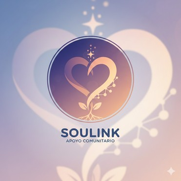
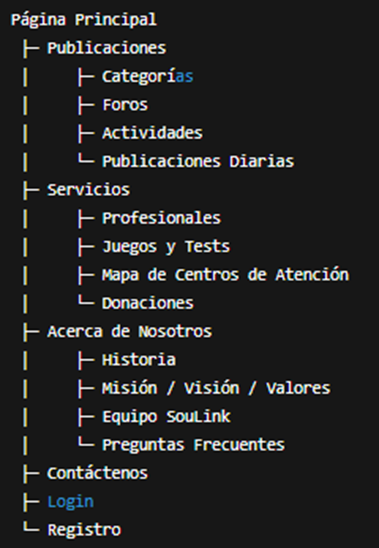
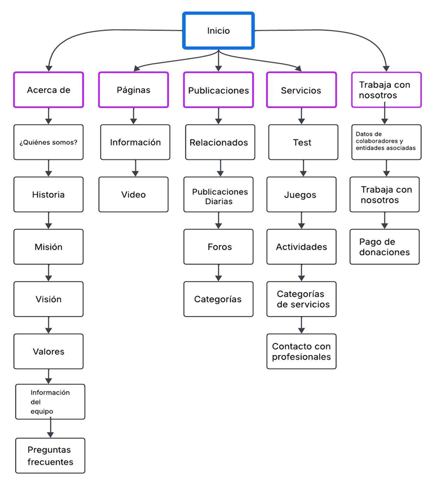

<h1 align="center">SOULINK - Q-ERO v3 Protocol</h1>

<table width="100%">
<tr>

<td width="50%" valign="top">

## 👥 Equipo Q-ERO v3 Protocol

- Agustín Ignacio Valenzuela Peña  
- Anita Fernanda Morales Moreno  
- Javier Ignacio Valenzuela Tobar  
- Karim Valenzuela Carrasco  
- Mauricio Daniel Narváez Villalobos  
- Nicolás Vladimir Peña Orrego  
- Vicente Andree Díaz Vergara  

</td>

<td width="50%" align="center" valign="middle">

  
  
  

</td>

</tr>
</table>

# **📄 Documento de Normas y Acuerdos del Equipo**

## **Normas de Convivencia**
### **1. Respeto mutuo**  
Todas las interacciones deben realizarse con respeto, sin discriminación, ofensas ni actitudes descalificadoras.

### **2. Comunicación clara**  
Uso de un lenguaje directo, cordial y comprensible.

### **3. Ambiente seguro**  
No se permite conducta agresiva, acoso o burlas hacia ningún integrante.

### **4. Participación activa**  
Todos deben conocer y participar del proceso, independiente de los liderazgos.

### **5. Toma de decisiones**  
Decisiones importantes se resolverán por votación simple.  
En caso de empate: **decide el Scrum Master**.

## **Normas de Trabajo**

### **Disponibilidad mínima**
- Responder mensajes en un máximo de 24 horas.  
- Asistir a reuniones programadas, salvo causa justificada.  
- Avisar con 24 horas de anticipación si no podrá asistir.

### **Compromiso con tareas**
- Entender la tarea asignada.  
- Pedir ayuda con anticipación si existen dudas.  
- Avisar con al menos 24 horas si no podrá completar una tarea.

### **Herramientas obligatorias**
- GitHub  
- Google Docs / Discord / Pendientes  

### **Herramientas complementarias**
- Canva  
- Figma  

### **Entrega de trabajo**
- Una reunión fija por semana para revisar avances, más reuniones dentro del horario de clases.

## **Acuerdos Colaborativos**

### **Reuniones semanales**
1 reunión fija semanal + reuniones adicionales durante el horario de clases.

### **Metodología Scrum**
- Roles definidos por Sprint  
- Tareas claras, medibles y organizadas  

### **Apoyo entre compañeros**
Si un integrante está atrasado, otro puede ayudar para evitar retrasos.

### **Retroalimentación respetuosa**
Críticas constructivas, orientadas a mejorar.

# **📘 Definición del Proyecto**

## **Problemática**
Chile vive una crisis de salud mental con altos niveles de ansiedad, depresión y conductas de riesgo.  
La oferta digital es limitada, poco accesible y no responde a la contención temprana.

Más de **1.602 suicidios por año** (MINSAL, 2022).

**SouLink** nace para ofrecer apoyo preventivo y acompañamiento inicial para personas en estrés, duelo o vulnerabilidad emocional.

## **Público Objetivo**
Personas residentes en Chile entre **15 y 45 años**, que buscan:

- Contención emocional inicial  
- Comprender mejor sus emociones  
- Acceder a herramientas de autocuidado  
- Resolver barreras económicas o largas listas de espera  
- Apoyar a familiares en momentos difíciles

SouLink ofrece **un espacio seguro, anónimo y moderado**.

# **Misión, Visión y Valores**

## **Misión**
Brindar una plataforma digital segura y accesible para apoyo emocional preventivo, entregando orientación confiable y espacios moderados donde los usuarios puedan expresarse de forma anónima.

## **Visión**
Convertirnos en la plataforma líder de apoyo emocional preventivo en Chile, promoviendo una cultura empática, informada y sin estigmas hacia la salud mental.

## **Valores**
- **Dignidad Humana**  
- **Seguridad y Protección**  
- **Empatía y Humanidad**  
- **Responsabilidad Social**  
- **Transparencia**  
- **Innovación con Propósito**  
- **Inclusión**  
- **Confidencialidad**

# **Modelo de Negocios**

SouLink opera como organización de impacto social, financiada principalmente por fondos externos tipo ONG.

### **Pilares del modelo**
- Plataforma gratuita en funciones esenciales  
- Uso de IA responsable para moderación y contenido  
- Recursos educativos y acompañamiento inicial  

### **Fuentes de sostenibilidad**
- Donaciones voluntarias  
- Membresías simbólicas  
- Convenios institucionales  
- Servicios profesionales opcionales  
- Contenido premium no esencial  
- Fondos estatales y concursables  
- Sponsors éticos  

# **Planificación: Procesos del Proyecto**

| Fase | Procesos Principales | Objetivo | Acciones |
|------|----------------------|----------|----------|
| **Diagnóstico** | Análisis del público y necesidades | Entender a los usuarios | Estudios, entrevistas, encuestas |
| **Diseño de arquitectura** | Estructura del sitio | Orden funcional | Mapa del sitio, wireframes |
| **Creación de contenido** | Desarrollo psicoeducativo | Material útil y validado | Redacción, revisión, validación ética |
| **Desarrollo** | Programación y validación | Sitio funcional | Front, Back, BD, seguridad |
| **Pruebas** | Testeo y ajustes | Mejorar experiencia | Pruebas piloto, feedback |
| **Implementación** | Lanzamiento | Publicar plataforma | Hosting, soporte |
| **Evaluación** | Impacto | Mejoras continuas | Métricas, reportes |

# **Roles del Equipo (Scrum)**

- **Product Owner:** Anita Morales  
- **Scrum Master:** Nicolás Vladimir Peña Orrego  
- **Desarrollador Back-End:** Mauricio Daniel Narváez Villalobos  
- **Desarrollador Back-End:** Javier Ignacio Valenzuela Tobar  
- **Desarrollador Full Stack:** Vicente Andree Díaz Vergara  
- **UX/UI Designer:** Karim Valenzuela Carrasco  
- **QA / Tester:** Agustín Ignacio Valenzuela Peña  

> **Nota:** Roles referenciales. Todo el equipo participa en todo.

# **Sprints del Proyecto**

### **Sprint 1 — Planificación y Bases**
1. Planificación general  
2. Retroalimentación  
3. Crear base de datos inicial  
4. Documento de normas  

### **Sprint 2 — Diseño Técnico**
5. Definir entidades y datos  
6. Requerimientos del sistema  
7. Estructura HTML + CSS  
8. Conexión inicial Front–Back  

### **Sprint 3 — Pruebas**
9. Pruebas funcionales iniciales  
10. Ajustes de usabilidad  
11. Pruebas avanzadas  
12. Pruebas completas  

### **Sprint 4 — Cierre**
13. Documentación final  
14. Preparación para presentación  
15. Ajustes finales  

# **Alcance del Proyecto**

## ✔️ **Incluye**
- Contención emocional preventiva  
- Herramientas educativas y guías  
- Foros moderados con apoyo de IA  
- Mapa de centros reales  
- Derivación temprana  
- Plataforma gratuita  

## ❌ **No Incluye**
- Terapia psicológica formal  
- Diagnósticos médicos  
- Atención de urgencia  
- Prescripción de medicamentos  
- Reemplazo del sistema de salud  
- Moderación automática sin humanos  

# **Mapa de Navegación**

El mapa de navegación muestra la estructura jerárquica del sitio y cómo el usuario recorre sus secciones.

* 

* 

# **Contenidos Mínimos (6 páginas)**

## **1. Página Principal**
- Encabezado  
- Carrusel  
- Botón “Necesito ayuda ahora”  
- Publicaciones nuevas  
- Footer  

## **2. Acerca de Nosotros**
- Historia  
- Misión, Visión, Valores  
- Equipo  
- Preguntas frecuentes  

## **3. Contáctenos**
- Formulario  
- Datos de contacto  
- Derivación a emergencias  

## **4. Servicios**
- Recursos  
- Juegos y tests  
- Profesionales externos  
- Mapa de centros  

## **5. Login**
- Iniciar sesión  
- Crear cuenta  
- Recuperar contraseña  

## **6. Publicaciones**
- Artículos  
- Categorías  
- Filtros  
- Buscador  

# **Tecnologías Utilizadas**

| Front End | Back End | Base de Datos | Control de Versiones |
|-----------|----------|----------------|-----------------------|
| HTML5 | Java | PostgreSQL | Git |
| CSS3 | Spring Boot | | GitHub |
| Bootstrap 4 | | | |
| ES6 (JavaScript) | | | |
| Postman | | | |

## **Justificación**
- **HTML5:** Accesibilidad + SEO  
- **CSS3:** Diseño responsivo  
- **Bootstrap 4:** Componentes rápidos y adaptables  
- **Java + Spring Boot:** Seguridad, modularidad, escalabilidad  
- **PostgreSQL:** Base de datos confiable  
- **Git/GitHub:** Trabajo colaborativo  
- **Postman:** Validación de API  

# **Pruebas del Sistema**

### **Frontend**
- Responsive Design  
- Funcionamiento de botones  
- Enlaces válidos  
- Validación de datos  
- Compatibilidad con navegadores  

### **Base de Datos**
- CRUD  
- Integridad relacional  
- Triggers / Procedimientos  

### **Backend**
- Función de métodos  
- Manejo de excepciones  

### **Conexiones**
- Front–Back mediante API  
- Back–BD mediante queries  

### **Deploy**
- Verificación del hosting  

# **Lanzamiento**
La plataforma será desplegada en **Heroku el 15/01/2026**.

# **Servicios Similares / Complementarios**

- **Apoyo a Víctimas de Violencia – 600 818 1000**

- **Quédate – Crisis suicida**  
  https://quedate.saludoriente.cl/

- **No estás sola/no estás solo – 4141 (MINSAL)**

- **Fono Drogas y Alcohol – 1412 (SENDA)**

- **Fono Familia – 149 (Carabineros)**

- **Fono Infancia – 800 200 818**  
  (Fundación Integra)

- **Hablemos de Todo – INJUV**  
  https://hablemosdetodo.injuv.gob.cl/

- **Fono Niños – 147 (Carabineros)**

- **Aquí Estoy**  
  https://aquiestoy.chat/

- **Orientación Mujer – 1455**

- **Psicólogos Voluntarios de Chile**  
  https://psicologosvoluntarios.cl  
  +56 9 7559 2366  

- **Todo Mejora – Apoyo LGBTIQ+**  
  https://www.todomejora.org

- **Salud Responde – 600 360 7777**  

