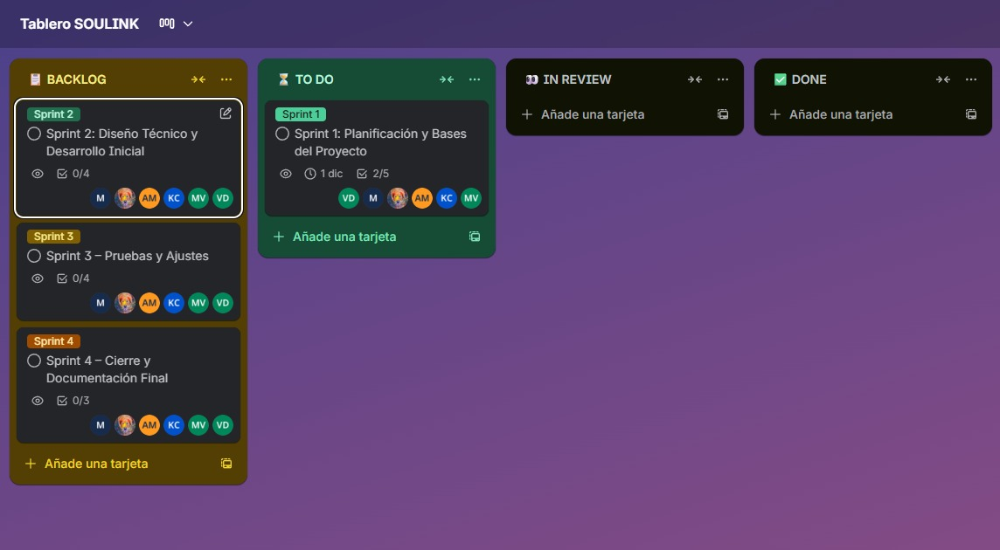
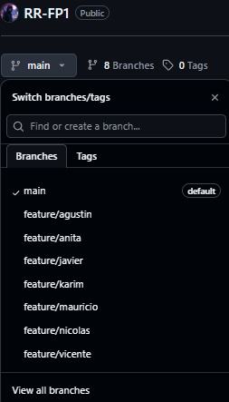
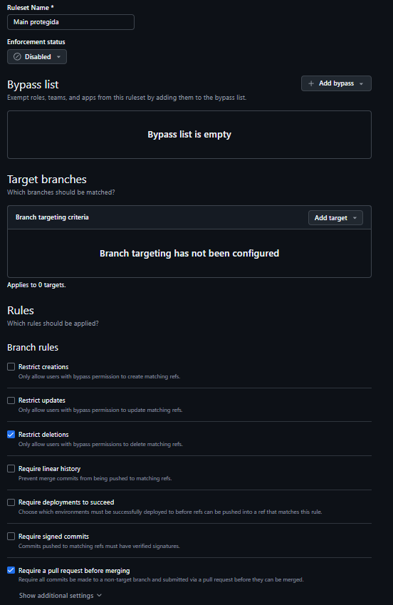

<h1 align="center">📋 Tarea 2 - Gestión de Proyecto SOULINK 📋</h1>

## 🎯 Evidencia de Cumplimiento - Criterios Evaluados

### ✅ **Tablero de flujo de trabajo definido**
**🔗 Enlace al Tablero Trello:** [https://trello.com/b/wu013GyD/tablero-soulink](https://trello.com/b/wu013GyD/tablero-soulink)

**Tablero Trello:** 

**Asignación equitativa evidenciada** mediante miembros asignados por tarjeta.

### ✅ **Repositorio GitHub colaborativo**
**🔗 Enlace al Repositorio:** [https://github.com/RyuZeNK-Ai/RR-FP1](https://github.com/RyuZeNK-Ai/RR-FP1)

**Estructura de ramas implementada:**  

**🛡️ Protección de Rama Main:**

**Reglas implementadas en GitHub:**  

